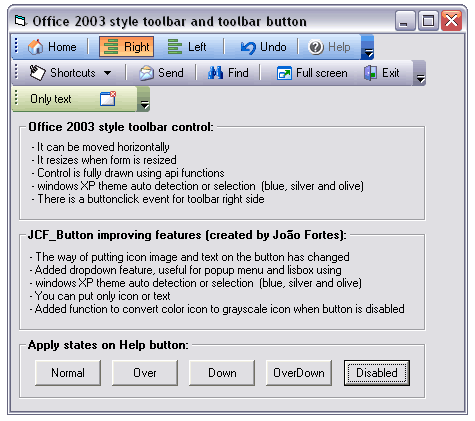



## Office 2003 style toolbar

### Description

This is my first project in PSC.

This a nice Office 2003 style toolbar for VB. You can built a nice Toolbar.The initial idea taken from JCF_Toolbutton created by Jo&#227;o Fortes.

I have made a compilation of different jobs published on Planet-Source-Code.com

I want to thank to

- Everyday Panos for your Office 2003 Button AND MOVING TOOLBAR project

- Fred cpp for api functions used in his isbutton control

- Carles P.V. for 3d UcVertical line

- and others authors of PSC

All control is drawn using api functions (no images, no other controls)

It is including an improving JCF_ToolButton created by Jo&#227;o Fortes.
 
### More Info
 

             |
---                |---
**Submitted On**   |2005-11-23 15:18:22
**By**             |[Juan Carlos San Román](https://github.com/Planet-Source-Code/PSCIndex/blob/master/ByAuthor/juan-carlos-san-rom-n.md)
**Level**          |Intermediate
**User Rating**    |4.8 (76 globes from 16 users)
**Compatibility**  |VB 6\.0
**Category**       |[Custom Controls/ Forms/  Menus](https://github.com/Planet-Source-Code/PSCIndex/blob/master/ByCategory/custom-controls-forms-menus__1-4.md)
**World**          |[Visual Basic](https://github.com/Planet-Source-Code/PSCIndex/blob/master/ByWorld/visual-basic.md)
**Archive File**   |[Office\_20019506311232005\.zip](https://github.com/Planet-Source-Code/juan-carlos-san-rom-n-office-2003-style-toolbar__1-63349/archive/master.zip)

